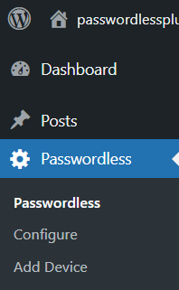

<!-- PROJECT SHIELDS -->

<!-- PROJECT LOGO -->
 

  

  <h3 align="center">Passwordless Authentication</h3>

<!-- TABLE OF CONTENTS -->

## Table of Contents

- [Table of Contents](#table-of-contents)
- [About The Project](#about-the-project)
- [Getting Started](#getting-started)
  - [Prerequisites](#prerequisites)
  - [WordPress Setup Guide](#wordpress-setup-guide)
  - [Building From Source](#building-from-source)
- [License](#license)
- [Contact](#contact)

<!-- ABOUT THE PROJECT -->

## About The Project

WordPress Plugin to enable a passwordless login experience using Passwordless's Web API.

This plugin will add two custom short codes `[passwordless-login-form]` and `[passwordless-remote-auth]`. These two short codes will generate a login form and a remote authentication form that will use Passwordless's  API to authenticate the admin/team member without a password.

The admin/team member must have a FIDO2 compatible device, otherwise this form will default back to using a password authentication instead.

This plugin is compatible with WordPress' default password login, so this should be compatible with existing authentication plugins.

<!-- GETTING STARTED -->

## Getting Started

### Prerequisites

As this is a wordpress plugin this project requires wordpress to run.

(OPTIONAL) If you wish to modify the Javascript source files and/or PHP dependencies within this project, then you would also need to nave Node, NPM, and Composer installed.

### WordPress Setup Guide

1. Install the plugin (through the zip file or through the wordpress plugin store)
2. Configure the plugin under Passwordless > Configure(as shown in the image below)

   

3. Visit [Passwordless Dashboard](https://app.passwordless4u.com/) click on the "Add Application" button to create application, select Web/Wordpress app and fill the form.
you'll get the following view when you click on "Save and Next".

Copy from the Passwordless dashboard

and paste the ClientId and BaseURL into the plugin configure page and save it.

4. Register your device
Click on "Add Device" button and select the authentication method you wish to use.

5. Two Pages will be auto generated when you install the plugin one is "Passwordless Sign In" page and "Authenticate Token". If "Passwordless Sign In" page slug is not set then it will be named "member-login" and for "Authenticate Token" page is "authenticate" slug.
example:
for "Passwordless Sign In" page slug:
https://your-domain.com/member-login
for "Authenticate Token" page slug:
https://your-domain.com/authenticate

<!-- LICENSE -->

## License

Distributed under the GPLv3 License. See `LICENSE` for more information.

<!-- CONTACT -->

## Contact

Passwordless - help@passwordless4u.com

If you need plugin help feel free to contact avi@mollatech.com (usually reply within 48 hours).

